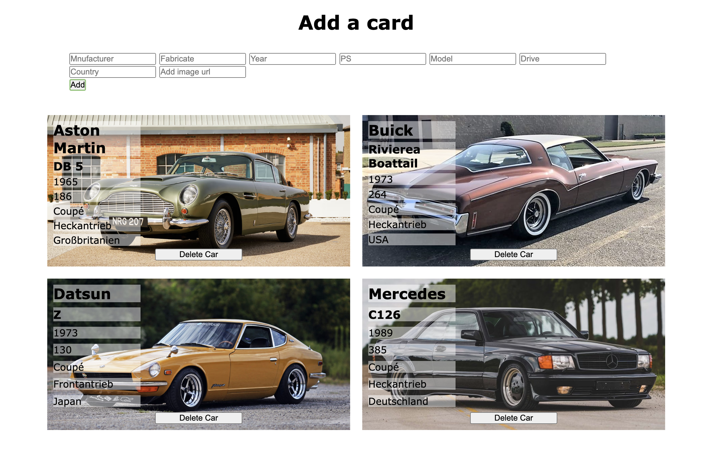

# Project Panini Sammelkarten



Dieses Projekt dient dazu, unsere voranschreitenden Typescript Kenntnisse anzuwenden und zu vertiefen.

Wir haben uns für Autos bzw. Oldtimer entschieden.
Nachfolgend finden sich einige Daten, die in das HTML eingegeben werden können, die dann natürlich auch ausgegeben werden.

## Project klonen und direkt im Browser testen

das Projekt kann mit Folgendem link geklont und in VS Code angesehen werden

```
git@github.com:Nana7782/Project-TS-Panini-Sammelalbum.git
```

## Auto Daten Vorschläge

1.

- Mercedes
- C126
- 1989
- 385
- Coupé
- Heckantrieb
- Deutschland
- https://imgr1.auto-motor-und-sport.de/Mercedes-Benz-560-SEC-AMG-6-0-Widebody-1989--169FullWidth-5b4cad7f-1716541.jpg

2.

- Aston Martin
- DB 5
- 1965
- 286
- Coupé
- Heckantrieb
- Großbritanien
- https://image-cdn.hypb.st/https%3A%2F%2Fhypebeast.com%2Fimage%2F2023%2F09%2Ftest-drive-aston-martin-db5-2.jpg?cbr=1&q=90

3.

- Buick
- Rivierea Boattail
- 1973
- 264
- Coupé
- Heckantrieb
- USA
- https://ccnwordpress.blob.core.windows.net/journal/2018/07/12694280-1973-buick-riviera-srcset-retina-md.jpg

4.

- Datsun
- Z
- 1973
- 130
- Coupé
- Frontantrieb
- Japan
- https://cdn.hiconsumption.com/wp-content/uploads/2019/02/Datsun-Z.jpg

### coded by Steve Dwumah & Nana Leven
